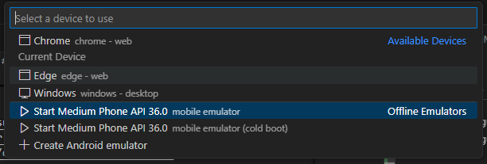
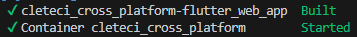
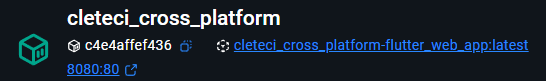

# cross-platform

Aplicación Cross Platform con código único base (Web, Android, iOS)

## Requisitos.

- [VSCode](https://code.visualstudio.com/).
- [Flutter](https://flutter.dev/).
- [Android Studio](https://developer.android.com/studio).

## Setup.

- Seguir la Guía de [Quickstart de Flutter](https://docs.flutter.dev/get-started/quick).
- Seguir la Guía de [Android Setup](https://docs.flutter.dev/platform-integration/android/setup).

## Ejecución del Proyecto.

En la Guía de [Quickstart de Flutter](https://docs.flutter.dev/get-started/quick) se encuentra cómo ejecutar el proyecto de Flutter en el navegador (Chrome; se inicia una ventana automáticamente). Para ejecutarlo en dispositivos Android, por ejemplo, se siguen los mismos pasos pero cambiando el dispositivo para ejecución del proyecto, como se muestra en la siguiente imagen:



### Ejecución de Proyecto Web con Docker.

Ejecutamos el siguiente comando para hacer *build* del contenedor de Docker:

```
docker-compose up --build -d
```

Debemos ver el siguiente mensaje indicando que se creó el contenedor:



En Docker Desktop, podremos ver lo siguiente:



## CI/CD Pipeline

This project uses GitHub Actions for continuous integration and deployment.

### Workflow Triggers

The CI pipeline runs on:
- Pushes to main, master, develop, and features branches
- Pull requests targeting these branches

### Jobs

- **test**: Sets up Flutter, installs dependencies, runs tests, and builds the web app
- **build-docker**: Builds the Docker image (only on pushes to master or develop branches)

### Docker Hub Integration

To enable automatic Docker Hub pushes:
1. Create a Docker Hub account at https://hub.docker.com/
2. Generate an access token in Account Settings > Security
3. Add `DOCKER_USERNAME` and `DOCKER_PASSWORD` as repository secrets in GitHub
4. Uncomment the Docker Hub steps in `.github/workflows/ci.yml`
Para ver el proyecto, vamos al siguiente URL: [http://localhost:8080/](http://localhost:8080/).